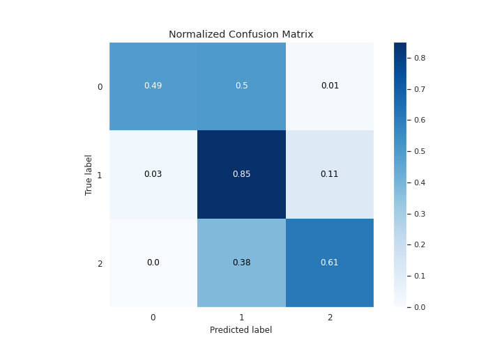

# Summary of 10_LightGBM

[<< Go back](../README.md)

## LightGBM
- **n_jobs**: 8
- **objective**: multiclass
- **num_leaves**: 31
- **learning_rate**: 0.1
- **feature_fraction**: 0.5
- **bagging_fraction**: 1.0
- **min_data_in_leaf**: 50
- **metric**: custom
- **custom_eval_metric_name**: f1
- **num_class**: 3
- **explain_level**: 1

## Validation
 - **validation_type**: kfold
 - **k_folds**: 5
 - **shuffle**: True
 - **stratify**: True

## Optimized metric
f1

## Training time

510.4 seconds

### Metric details
|           |            0 |             1 |            2 |   accuracy |     macro avg |   weighted avg |   logloss |
|:----------|-------------:|--------------:|-------------:|-----------:|--------------:|---------------:|----------:|
| precision |     0.700907 |      0.734086 |     0.755511 |    0.73766 |      0.730168 |       0.738061 |  0.591093 |
| recall    |     0.492184 |      0.85263  |     0.612922 |    0.73766 |      0.652579 |       0.73766  |  0.591093 |
| f1-score  |     0.578289 |      0.78893  |     0.676788 |    0.73766 |      0.681335 |       0.731095 |  0.591093 |
| support   | 20088        | 118606        | 69787        |    0.73766 | 208481        |  208481        |  0.591093 |

## Confusion matrix
|              |   Predicted as 0 |   Predicted as 1 |   Predicted as 2 |
|:-------------|-----------------:|-----------------:|-----------------:|
| Labeled as 0 |             9887 |             9946 |              255 |
| Labeled as 1 |             3892 |           101127 |            13587 |
| Labeled as 2 |              327 |            26686 |            42774 |

## Learning curves

## Permutation-based Importance

## Confusion Matrix

## Normalized Confusion Matrix

## ROC Curve

## Precision Recall Curve

[<< Go back](../README.md)
