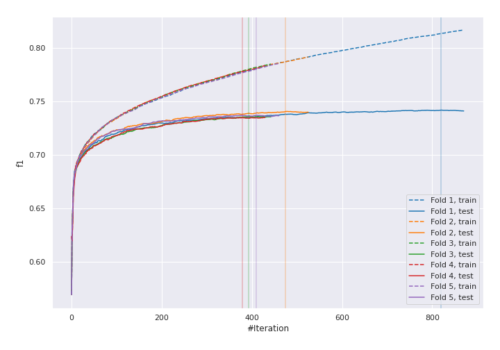
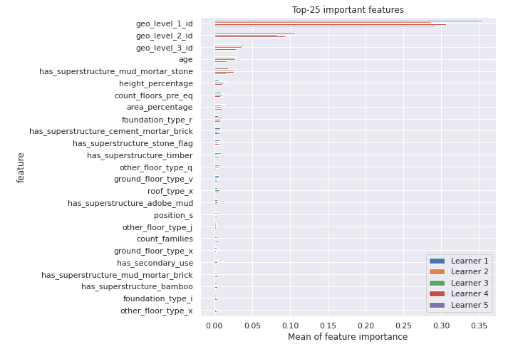
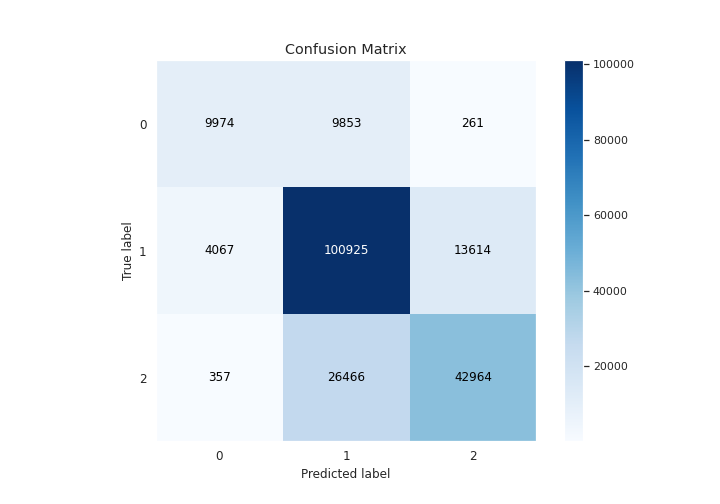
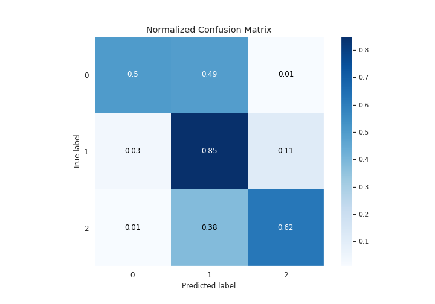
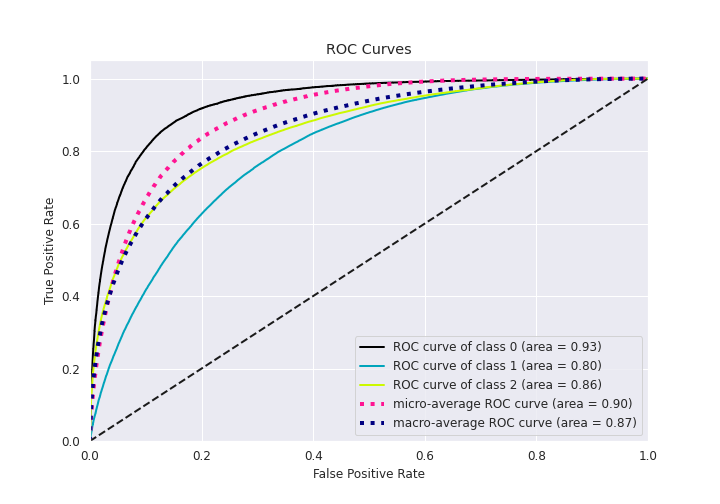
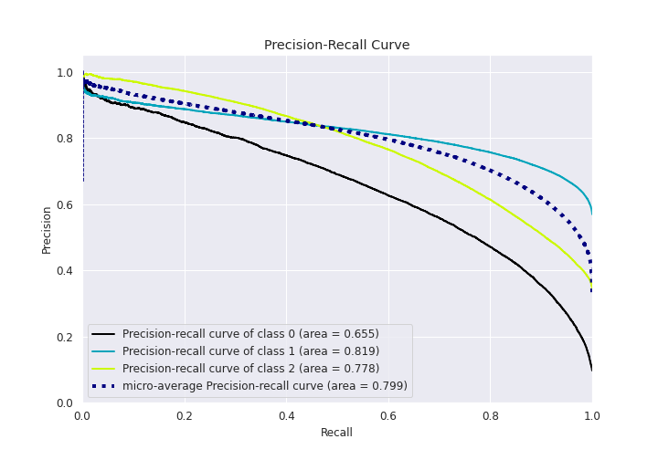

# Summary of 11_LightGBM

[<< Go back](../README.md)

## LightGBM
- **n_jobs**: 8
- **objective**: multiclass
- **num_leaves**: 31
- **learning_rate**: 0.2
- **feature_fraction**: 0.5
- **bagging_fraction**: 0.8
- **min_data_in_leaf**: 20
- **metric**: custom
- **custom_eval_metric_name**: f1
- **num_class**: 3
- **explain_level**: 1

## Validation
 - **validation_type**: kfold
 - **k_folds**: 5
 - **shuffle**: True
 - **stratify**: True

## Optimized metric
f1

## Training time

307.1 seconds

### Metric details
|           |            0 |             1 |            2 |   accuracy |     macro avg |   weighted avg |   logloss |
|:----------|-------------:|--------------:|-------------:|-----------:|--------------:|---------------:|----------:|
| precision |     0.692735 |      0.735369 |     0.755889 |   0.738019 |      0.727998 |       0.73813  |  0.592805 |
| recall    |     0.496515 |      0.850927 |     0.615645 |   0.738019 |      0.654362 |       0.738019 |  0.592805 |
| f1-score  |     0.578438 |      0.788939 |     0.678597 |   0.738019 |      0.681991 |       0.73172  |  0.592805 |
| support   | 20088        | 118606        | 69787        |   0.738019 | 208481        |  208481        |  0.592805 |

## Confusion matrix
|              |   Predicted as 0 |   Predicted as 1 |   Predicted as 2 |
|:-------------|-----------------:|-----------------:|-----------------:|
| Labeled as 0 |             9974 |             9853 |              261 |
| Labeled as 1 |             4067 |           100925 |            13614 |
| Labeled as 2 |              357 |            26466 |            42964 |

## Learning curves

## Permutation-based Importance

## Confusion Matrix

## Normalized Confusion Matrix

## ROC Curve

## Precision Recall Curve

[<< Go back](../README.md)
