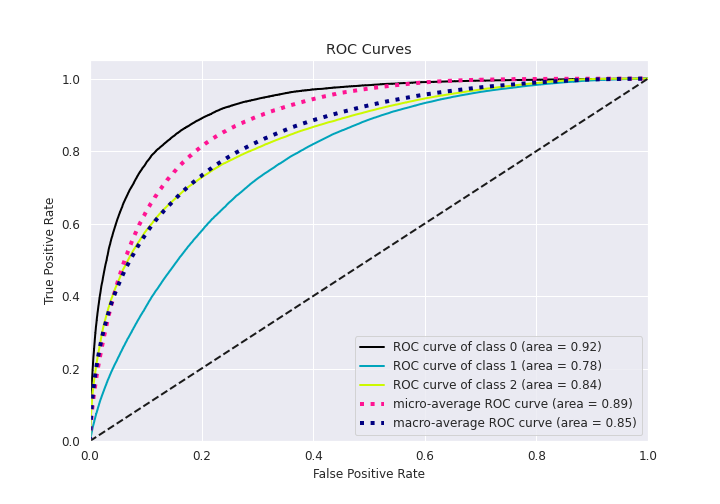

# Summary of 13_CatBoost

[<< Go back](../README.md)

## CatBoost
- **n_jobs**: 8
- **learning_rate**: 0.1
- **depth**: 5
- **rsm**: 1.0
- **loss_function**: MultiClass
- **eval_metric**: TotalF1:average=Micro
- **num_class**: 3
- **explain_level**: 1

## Validation
 - **validation_type**: kfold
 - **k_folds**: 5
 - **shuffle**: True
 - **stratify**: True

## Optimized metric
f1

## Training time

173.6 seconds

### Metric details
|           |            0 |             1 |            2 |   accuracy |     macro avg |   weighted avg |   logloss |
|:----------|-------------:|--------------:|-------------:|-----------:|--------------:|---------------:|----------:|
| precision |     0.686678 |      0.716505 |     0.744286 |   0.721941 |      0.715823 |       0.72293  |  0.626032 |
| recall    |     0.436728 |      0.852942 |     0.581398 |   0.721941 |      0.623689 |       0.721941 |  0.626032 |
| f1-score  |     0.533897 |      0.778793 |     0.652835 |   0.721941 |      0.655175 |       0.713033 |  0.626032 |
| support   | 20088        | 118606        | 69787        |   0.721941 | 208481        |  208481        |  0.626032 |

## Confusion matrix
|              |   Predicted as 0 |   Predicted as 1 |   Predicted as 2 |
|:-------------|-----------------:|-----------------:|-----------------:|
| Labeled as 0 |             8773 |            11074 |              241 |
| Labeled as 1 |             3743 |           101164 |            13699 |
| Labeled as 2 |              260 |            28953 |            40574 |

## Learning curves

## Permutation-based Importance

## Confusion Matrix

## Normalized Confusion Matrix

## ROC Curve

## Precision Recall Curve

[<< Go back](../README.md)
