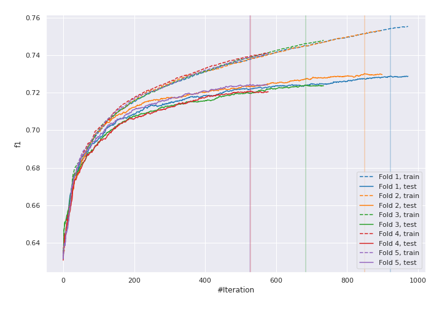
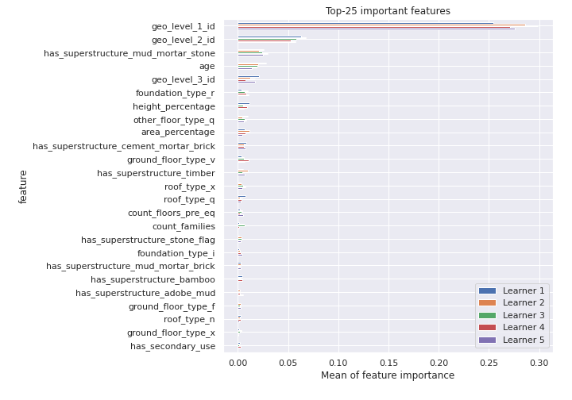
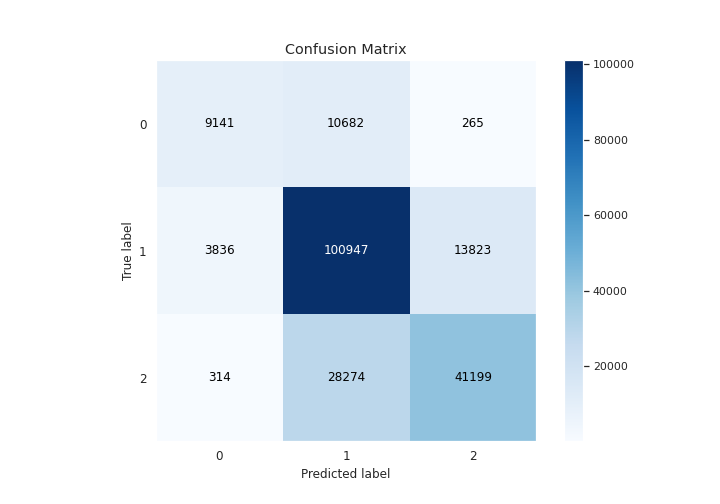
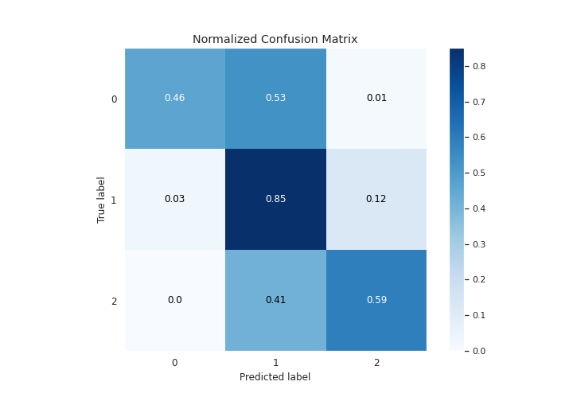
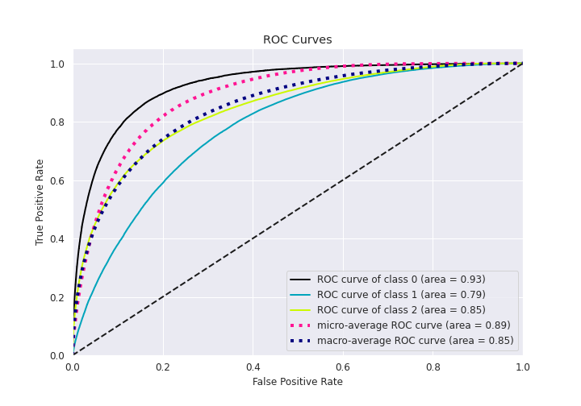
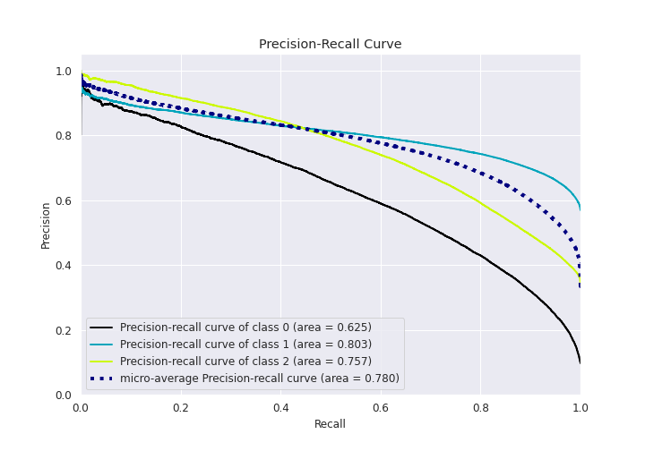

# Summary of 14_CatBoost

[<< Go back](../README.md)

## CatBoost
- **n_jobs**: 8
- **learning_rate**: 0.2
- **depth**: 6
- **rsm**: 0.8
- **loss_function**: MultiClass
- **eval_metric**: TotalF1:average=Micro
- **num_class**: 3
- **explain_level**: 1

## Validation
 - **validation_type**: kfold
 - **k_folds**: 5
 - **shuffle**: True
 - **stratify**: True

## Optimized metric
f1

## Training time

117.1 seconds

### Metric details
|           |            0 |             1 |            2 |   accuracy |     macro avg |   weighted avg |   logloss |
|:----------|-------------:|--------------:|-------------:|-----------:|--------------:|---------------:|----------:|
| precision |     0.687759 |      0.72155  |     0.745184 |   0.725663 |      0.718164 |       0.726205 |   0.61853 |
| recall    |     0.455048 |      0.851112 |     0.590354 |   0.725663 |      0.632171 |       0.725663 |   0.61853 |
| f1-score  |     0.54771  |      0.780994 |     0.658794 |   0.725663 |      0.662499 |       0.717611 |   0.61853 |
| support   | 20088        | 118606        | 69787        |   0.725663 | 208481        |  208481        |   0.61853 |

## Confusion matrix
|              |   Predicted as 0 |   Predicted as 1 |   Predicted as 2 |
|:-------------|-----------------:|-----------------:|-----------------:|
| Labeled as 0 |             9141 |            10682 |              265 |
| Labeled as 1 |             3836 |           100947 |            13823 |
| Labeled as 2 |              314 |            28274 |            41199 |

## Learning curves

## Permutation-based Importance

## Confusion Matrix

## Normalized Confusion Matrix

## ROC Curve

## Precision Recall Curve

[<< Go back](../README.md)
