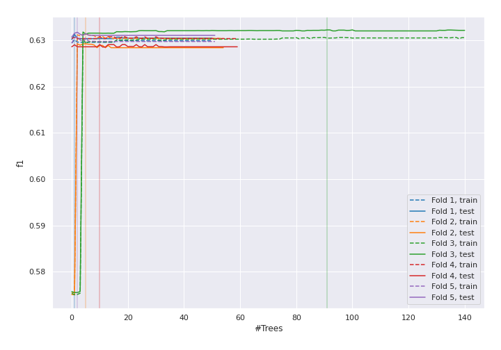
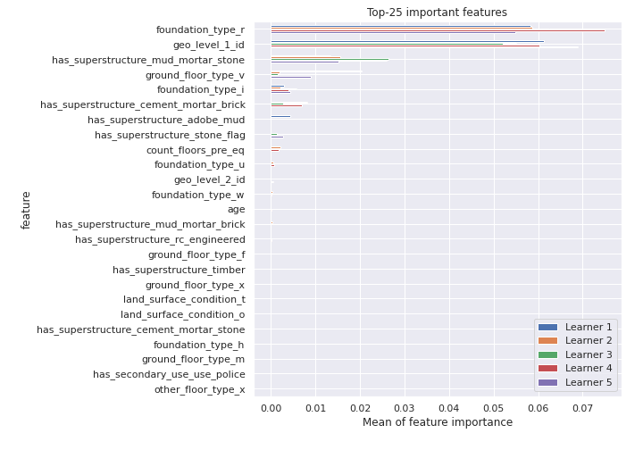
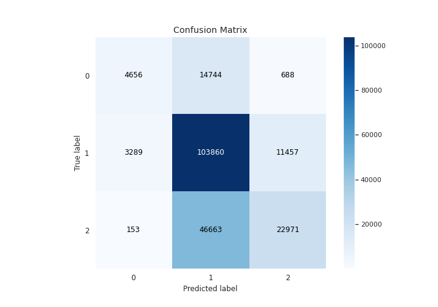
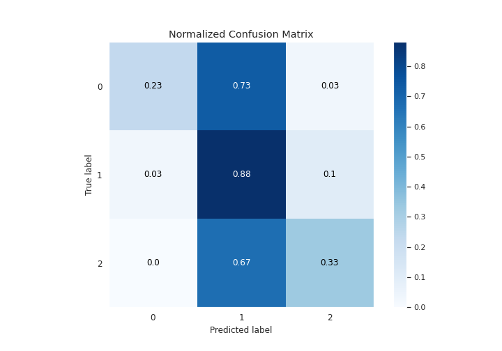
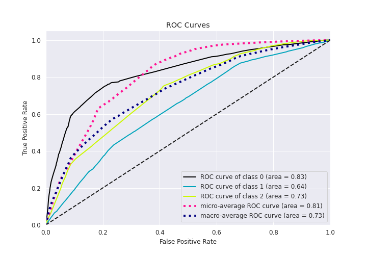
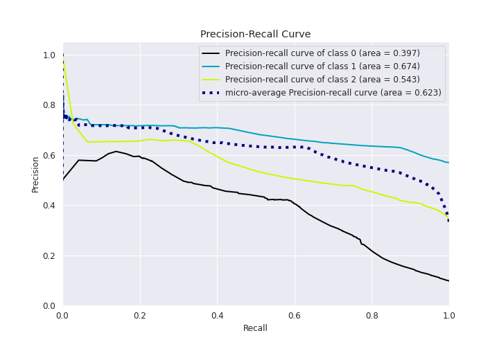

# Summary of 17_RandomForest

[<< Go back](../README.md)

## Random Forest
- **n_jobs**: 8
- **criterion**: entropy
- **max_features**: 0.9
- **min_samples_split**: 20
- **max_depth**: 3
- **eval_metric_name**: f1
- **num_class**: 3
- **explain_level**: 1

## Validation
 - **validation_type**: kfold
 - **k_folds**: 5
 - **shuffle**: True
 - **stratify**: True

## Optimized metric
f1

## Training time

75.3 seconds

### Metric details
|           |            0 |             1 |            2 |   accuracy |    macro avg |   weighted avg |   logloss |
|:----------|-------------:|--------------:|-------------:|-----------:|-------------:|---------------:|----------:|
| precision |     0.574957 |      0.628438 |     0.654146 |   0.630691 |      0.61918 |       0.63189  |  0.788796 |
| recall    |     0.23178  |      0.875672 |     0.329159 |   0.630691 |      0.47887 |       0.630691 |  0.788796 |
| f1-score  |     0.330377 |      0.731736 |     0.437947 |   0.630691 |      0.50002 |       0.59472  |  0.788796 |
| support   | 20088        | 118606        | 69787        |   0.630691 | 208481       |  208481        |  0.788796 |

## Confusion matrix
|              |   Predicted as 0 |   Predicted as 1 |   Predicted as 2 |
|:-------------|-----------------:|-----------------:|-----------------:|
| Labeled as 0 |             4656 |            14744 |              688 |
| Labeled as 1 |             3289 |           103860 |            11457 |
| Labeled as 2 |              153 |            46663 |            22971 |

## Learning curves

## Permutation-based Importance

## Confusion Matrix

## Normalized Confusion Matrix

## ROC Curve

## Precision Recall Curve

[<< Go back](../README.md)
