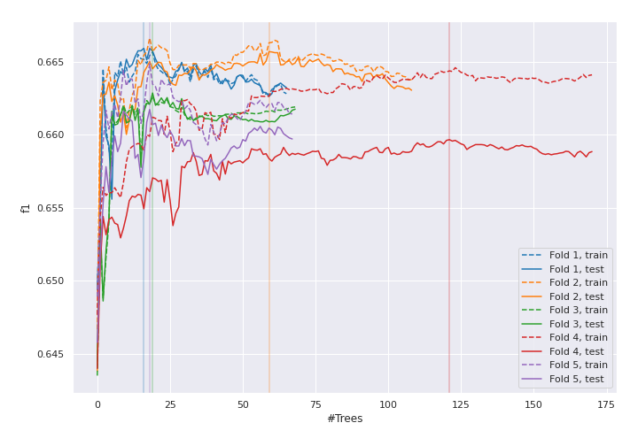
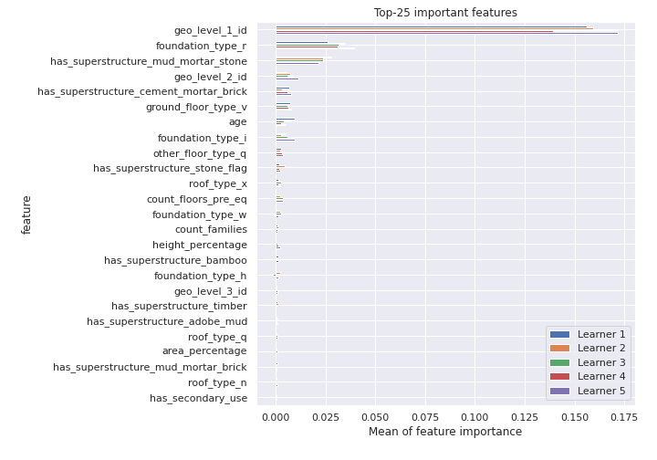
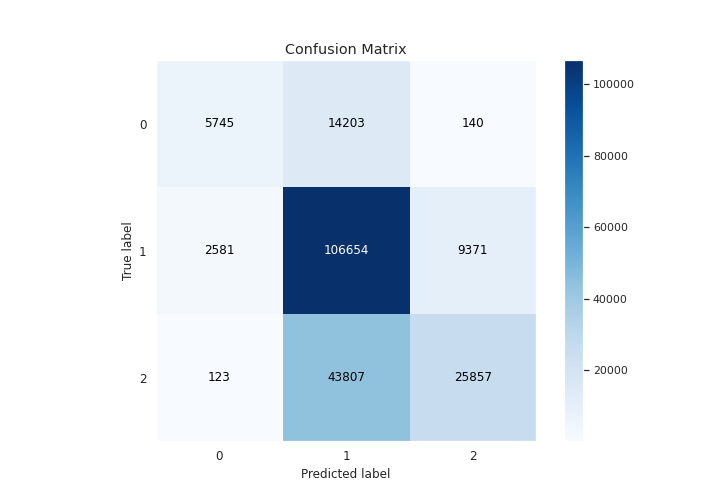
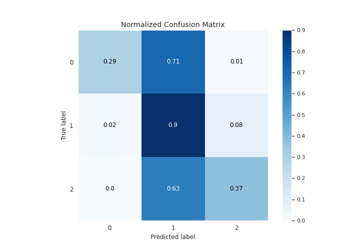
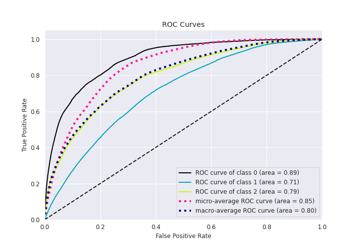
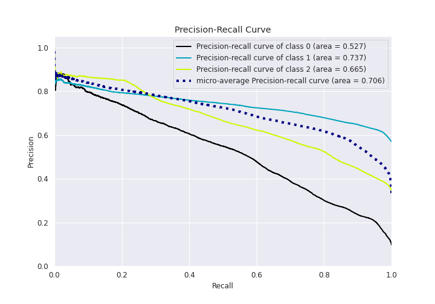

# Summary of 18_RandomForest

[<< Go back](../README.md)

## Random Forest
- **n_jobs**: 8
- **criterion**: gini
- **max_features**: 0.6
- **min_samples_split**: 20
- **max_depth**: 7
- **eval_metric_name**: f1
- **num_class**: 3
- **explain_level**: 1

## Validation
 - **validation_type**: kfold
 - **k_folds**: 5
 - **shuffle**: True
 - **stratify**: True

## Optimized metric
f1

## Training time

117.9 seconds

### Metric details
|           |            0 |             1 |            2 |   accuracy |     macro avg |   weighted avg |   logloss |
|:----------|-------------:|--------------:|-------------:|-----------:|--------------:|---------------:|----------:|
| precision |     0.679962 |      0.647707 |     0.731085 |   0.663159 |      0.686251 |       0.678725 |   0.71043 |
| recall    |     0.285992 |      0.899229 |     0.370513 |   0.663159 |      0.518578 |       0.663159 |   0.71043 |
| f1-score  |     0.402635 |      0.75302  |     0.491788 |   0.663159 |      0.549148 |       0.631814 |   0.71043 |
| support   | 20088        | 118606        | 69787        |   0.663159 | 208481        |  208481        |   0.71043 |

## Confusion matrix
|              |   Predicted as 0 |   Predicted as 1 |   Predicted as 2 |
|:-------------|-----------------:|-----------------:|-----------------:|
| Labeled as 0 |             5745 |            14203 |              140 |
| Labeled as 1 |             2581 |           106654 |             9371 |
| Labeled as 2 |              123 |            43807 |            25857 |

## Learning curves

## Permutation-based Importance

## Confusion Matrix

## Normalized Confusion Matrix

## ROC Curve

## Precision Recall Curve

[<< Go back](../README.md)
