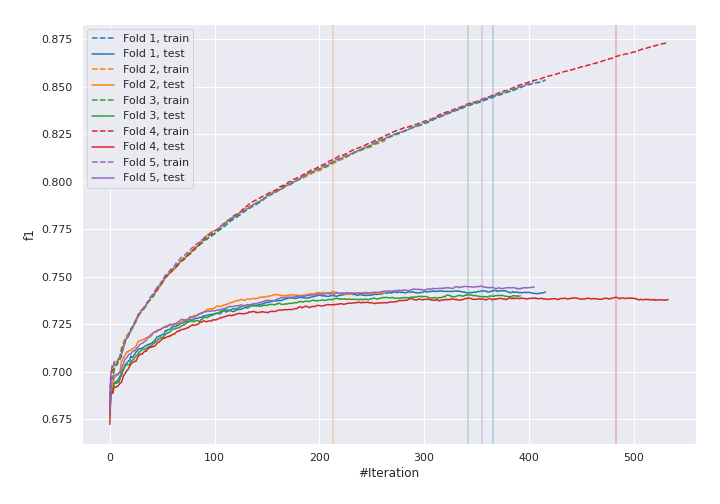
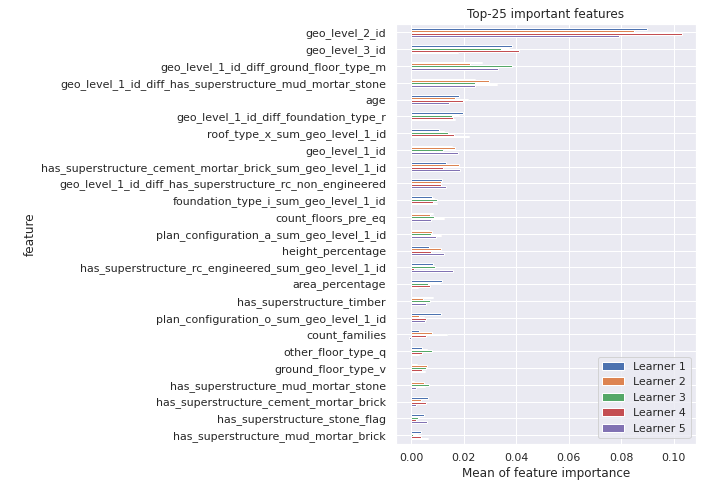
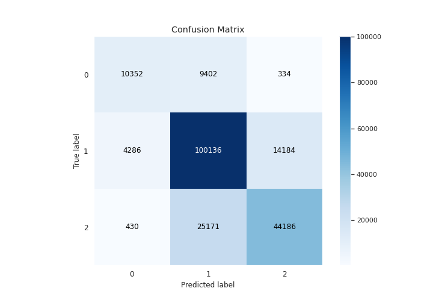
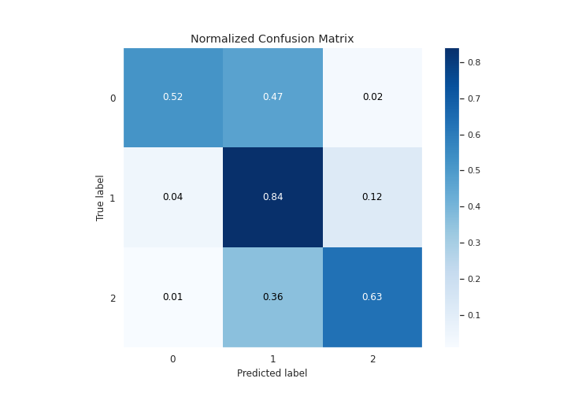
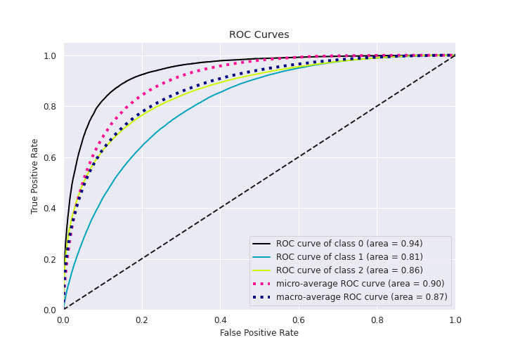
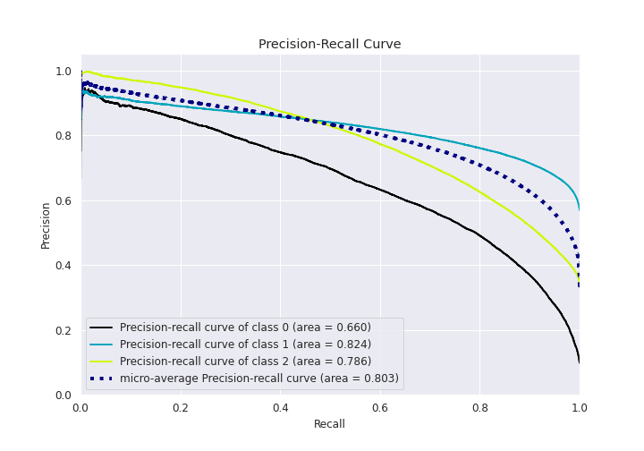

# Summary of 19_Xgboost_GoldenFeatures

[<< Go back](../README.md)

## Extreme Gradient Boosting (Xgboost)
- **n_jobs**: 8
- **objective**: multi:softprob
- **eta**: 0.15
- **max_depth**: 9
- **min_child_weight**: 1
- **subsample**: 0.7
- **colsample_bytree**: 0.5
- **eval_metric**: f1
- **num_class**: 3
- **explain_level**: 1

## Validation
 - **validation_type**: kfold
 - **k_folds**: 5
 - **shuffle**: True
 - **stratify**: True

## Optimized metric
f1

## Training time

548.0 seconds

### Metric details
|           |            0 |             1 |            2 |   accuracy |     macro avg |   weighted avg |   logloss |
|:----------|-------------:|--------------:|-------------:|-----------:|--------------:|---------------:|----------:|
| precision |     0.687019 |      0.74335  |     0.752691 |   0.741909 |      0.727687 |       0.74105  |  0.584595 |
| recall    |     0.515333 |      0.844274 |     0.633155 |   0.741909 |      0.664254 |       0.741909 |  0.584595 |
| f1-score  |     0.588918 |      0.790605 |     0.687768 |   0.741909 |      0.689097 |       0.736748 |  0.584595 |
| support   | 20088        | 118606        | 69787        |   0.741909 | 208481        |  208481        |  0.584595 |

## Confusion matrix
|              |   Predicted as 0 |   Predicted as 1 |   Predicted as 2 |
|:-------------|-----------------:|-----------------:|-----------------:|
| Labeled as 0 |            10352 |             9402 |              334 |
| Labeled as 1 |             4286 |           100136 |            14184 |
| Labeled as 2 |              430 |            25171 |            44186 |

## Learning curves

## Permutation-based Importance

## Confusion Matrix

## Normalized Confusion Matrix

## ROC Curve

## Precision Recall Curve

[<< Go back](../README.md)
