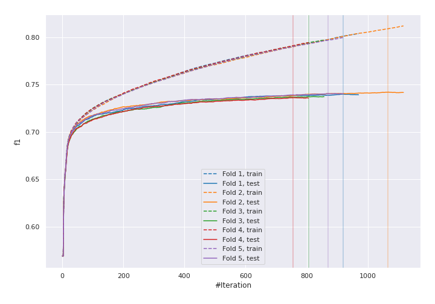
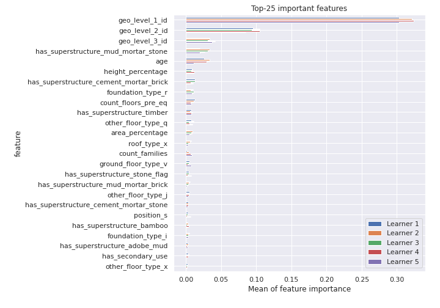
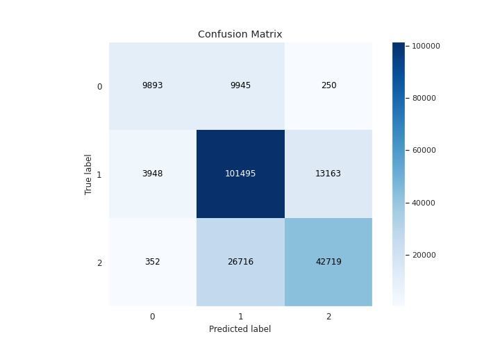
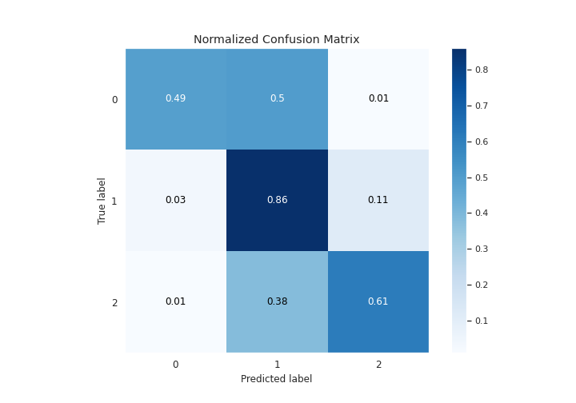
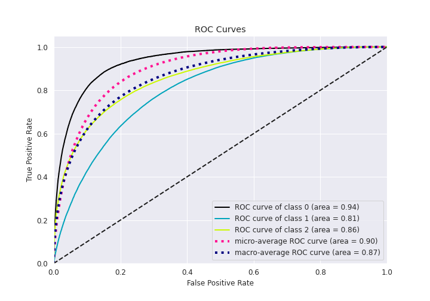
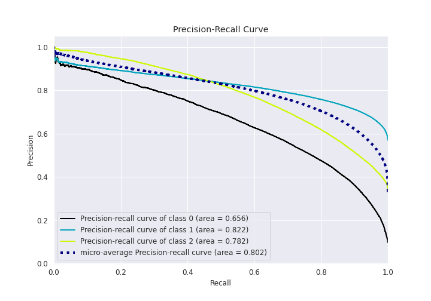

# Summary of 1_Default_LightGBM

[<< Go back](../README.md)

## LightGBM
- **n_jobs**: 8
- **objective**: multiclass
- **num_leaves**: 63
- **learning_rate**: 0.05
- **feature_fraction**: 0.9
- **bagging_fraction**: 0.9
- **min_data_in_leaf**: 10
- **metric**: custom
- **custom_eval_metric_name**: f1
- **num_class**: 3
- **explain_level**: 1

## Validation
 - **validation_type**: kfold
 - **k_folds**: 5
 - **shuffle**: True
 - **stratify**: True

## Optimized metric
f1

## Training time

630.9 seconds

### Metric details
|           |            0 |             1 |            2 |   accuracy |     macro avg |   weighted avg |   logloss |
|:----------|-------------:|--------------:|-------------:|-----------:|--------------:|---------------:|----------:|
| precision |     0.697034 |      0.734641 |     0.761045 |    0.73919 |      0.730907 |       0.739856 |  0.589323 |
| recall    |     0.492483 |      0.855732 |     0.612134 |    0.73919 |      0.65345  |       0.73919  |  0.589323 |
| f1-score  |     0.577171 |      0.790576 |     0.678516 |    0.73919 |      0.682088 |       0.732503 |  0.589323 |
| support   | 20088        | 118606        | 69787        |    0.73919 | 208481        |  208481        |  0.589323 |

## Confusion matrix
|              |   Predicted as 0 |   Predicted as 1 |   Predicted as 2 |
|:-------------|-----------------:|-----------------:|-----------------:|
| Labeled as 0 |             9893 |             9945 |              250 |
| Labeled as 1 |             3948 |           101495 |            13163 |
| Labeled as 2 |              352 |            26716 |            42719 |

## Learning curves

## Permutation-based Importance

## Confusion Matrix

## Normalized Confusion Matrix

## ROC Curve

## Precision Recall Curve

[<< Go back](../README.md)
