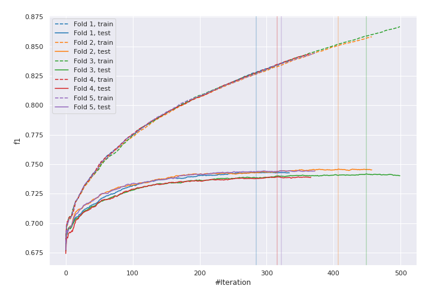
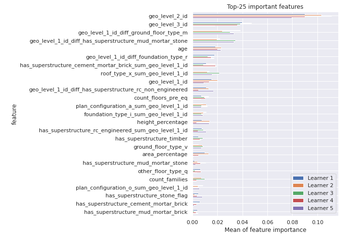
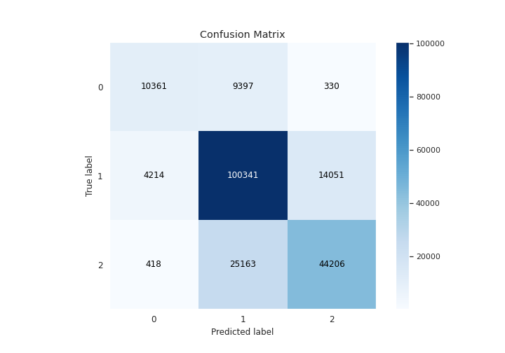
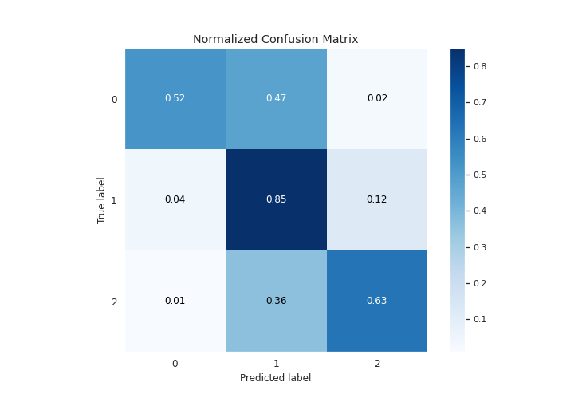
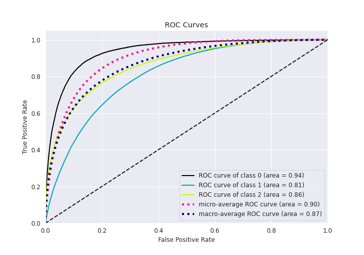
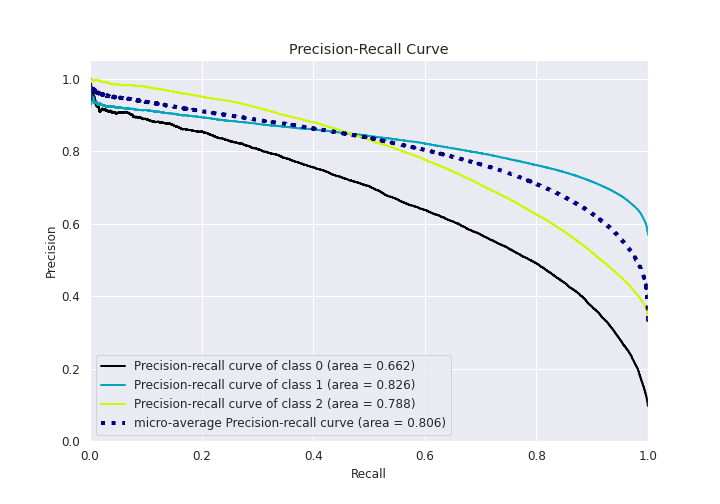

# Summary of 20_Xgboost_GoldenFeatures

[<< Go back](../README.md)

## Extreme Gradient Boosting (Xgboost)
- **n_jobs**: 8
- **objective**: multi:softprob
- **eta**: 0.15
- **max_depth**: 9
- **min_child_weight**: 1
- **subsample**: 0.9
- **colsample_bytree**: 0.5
- **eval_metric**: f1
- **num_class**: 3
- **explain_level**: 1

## Validation
 - **validation_type**: kfold
 - **k_folds**: 5
 - **shuffle**: True
 - **stratify**: True

## Optimized metric
f1

## Training time

531.3 seconds

### Metric details
|           |            0 |             1 |            2 |   accuracy |     macro avg |   weighted avg |   logloss |
|:----------|-------------:|--------------:|-------------:|-----------:|--------------:|---------------:|----------:|
| precision |     0.691056 |      0.743812 |     0.754536 |   0.743032 |      0.729801 |       0.742319 |  0.581619 |
| recall    |     0.515781 |      0.846003 |     0.633442 |   0.743032 |      0.665075 |       0.743032 |  0.581619 |
| f1-score  |     0.59069  |      0.791623 |     0.688706 |   0.743032 |      0.69034  |       0.737812 |  0.581619 |
| support   | 20088        | 118606        | 69787        |   0.743032 | 208481        |  208481        |  0.581619 |

## Confusion matrix
|              |   Predicted as 0 |   Predicted as 1 |   Predicted as 2 |
|:-------------|-----------------:|-----------------:|-----------------:|
| Labeled as 0 |            10361 |             9397 |              330 |
| Labeled as 1 |             4214 |           100341 |            14051 |
| Labeled as 2 |              418 |            25163 |            44206 |

## Learning curves

## Permutation-based Importance

## Confusion Matrix

## Normalized Confusion Matrix

## ROC Curve

## Precision Recall Curve

[<< Go back](../README.md)
