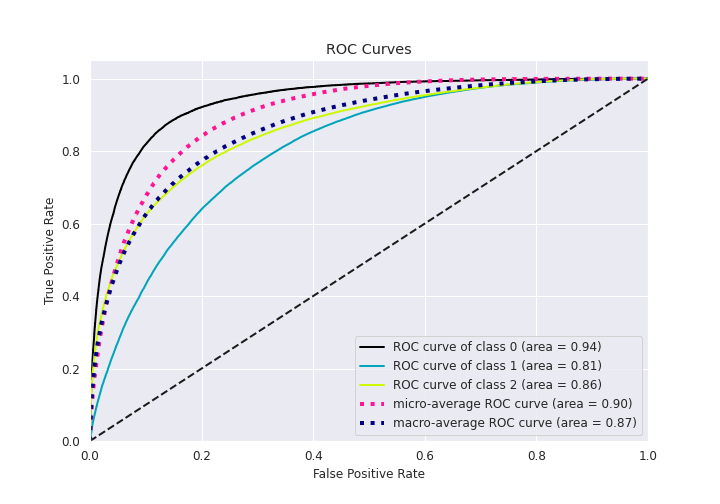

# Summary of 21_Xgboost

[<< Go back](../README.md)

## Extreme Gradient Boosting (Xgboost)
- **n_jobs**: 8
- **objective**: multi:softprob
- **eta**: 0.15
- **max_depth**: 9
- **min_child_weight**: 1
- **subsample**: 0.7
- **colsample_bytree**: 0.5
- **eval_metric**: f1
- **num_class**: 3
- **explain_level**: 1

## Validation
 - **validation_type**: kfold
 - **k_folds**: 5
 - **shuffle**: True
 - **stratify**: True

## Optimized metric
f1

## Training time

417.8 seconds

### Metric details
|           |            0 |             1 |            2 |   accuracy |     macro avg |   weighted avg |   logloss |
|:----------|-------------:|--------------:|-------------:|-----------:|--------------:|---------------:|----------:|
| precision |     0.693486 |      0.740769 |     0.756036 |   0.741674 |      0.730097 |       0.741324 |  0.584904 |
| recall    |     0.507168 |      0.848987 |     0.626793 |   0.741674 |      0.660983 |       0.741674 |  0.584904 |
| f1-score  |     0.585871 |      0.791195 |     0.685375 |   0.741674 |      0.68748  |       0.735989 |  0.584904 |
| support   | 20088        | 118606        | 69787        |   0.741674 | 208481        |  208481        |  0.584904 |

## Confusion matrix
|              |   Predicted as 0 |   Predicted as 1 |   Predicted as 2 |
|:-------------|-----------------:|-----------------:|-----------------:|
| Labeled as 0 |            10188 |             9594 |              306 |
| Labeled as 1 |             4102 |           100695 |            13809 |
| Labeled as 2 |              401 |            25644 |            43742 |

## Learning curves

## Permutation-based Importance

## Confusion Matrix

## Normalized Confusion Matrix

## ROC Curve

## Precision Recall Curve

[<< Go back](../README.md)
