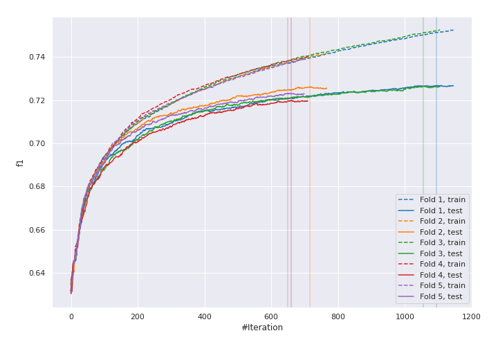
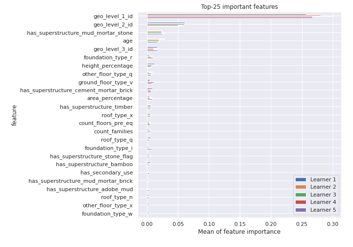
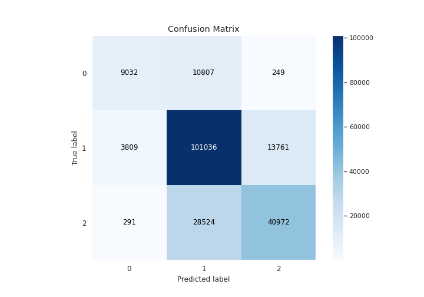
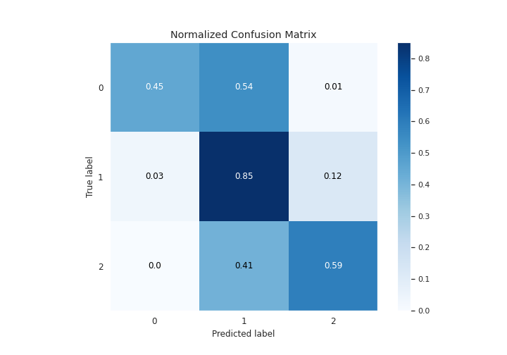
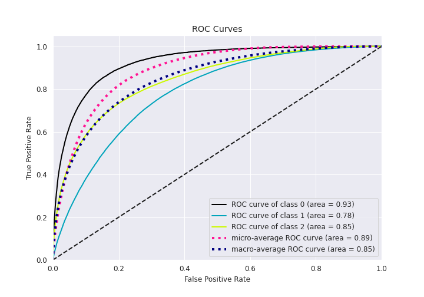
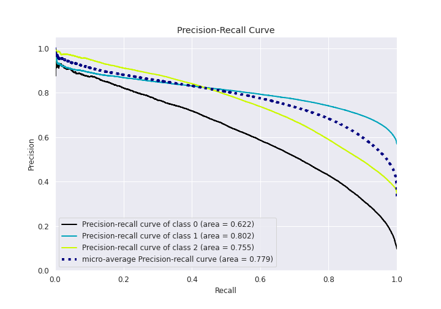

# Summary of 28_CatBoost

[<< Go back](../README.md)

## CatBoost
- **n_jobs**: 8
- **learning_rate**: 0.15
- **depth**: 6
- **rsm**: 0.8
- **loss_function**: MultiClass
- **eval_metric**: TotalF1:average=Micro
- **num_class**: 3
- **explain_level**: 1

## Validation
 - **validation_type**: kfold
 - **k_folds**: 5
 - **shuffle**: True
 - **stratify**: True

## Optimized metric
f1

## Training time

133.3 seconds

### Metric details
|           |            0 |             1 |            2 |   accuracy |     macro avg |   weighted avg |   logloss |
|:----------|-------------:|--------------:|-------------:|-----------:|--------------:|---------------:|----------:|
| precision |     0.687786 |      0.719799 |     0.745189 |   0.724478 |      0.717591 |       0.725213 |  0.620511 |
| recall    |     0.449622 |      0.851862 |     0.587101 |   0.724478 |      0.629528 |       0.724478 |  0.620511 |
| f1-score  |     0.543769 |      0.780282 |     0.656766 |   0.724478 |      0.660272 |       0.716147 |  0.620511 |
| support   | 20088        | 118606        | 69787        |   0.724478 | 208481        |  208481        |  0.620511 |

## Confusion matrix
|              |   Predicted as 0 |   Predicted as 1 |   Predicted as 2 |
|:-------------|-----------------:|-----------------:|-----------------:|
| Labeled as 0 |             9032 |            10807 |              249 |
| Labeled as 1 |             3809 |           101036 |            13761 |
| Labeled as 2 |              291 |            28524 |            40972 |

## Learning curves

## Permutation-based Importance

## Confusion Matrix

## Normalized Confusion Matrix

## ROC Curve

## Precision Recall Curve

[<< Go back](../README.md)
