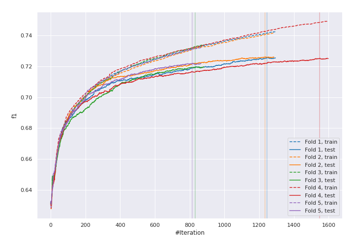
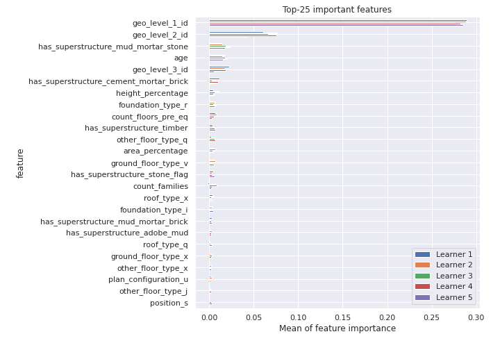
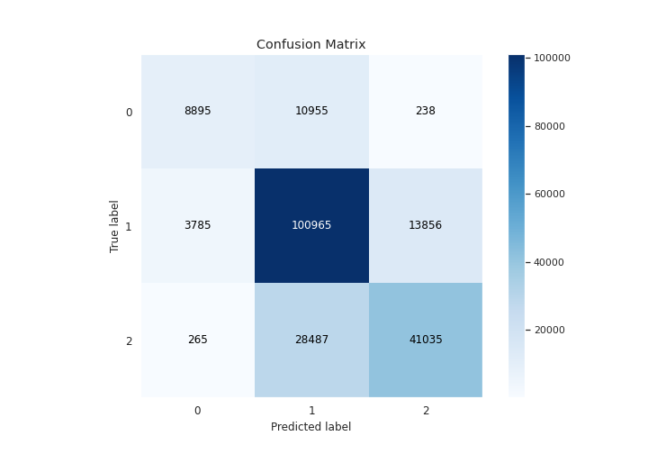
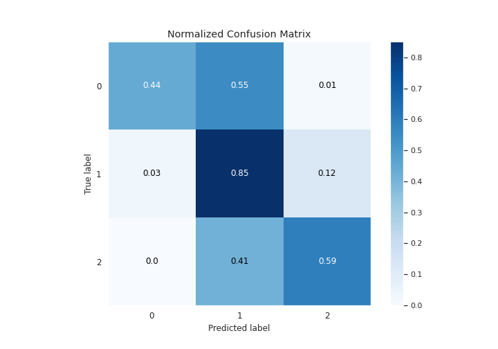
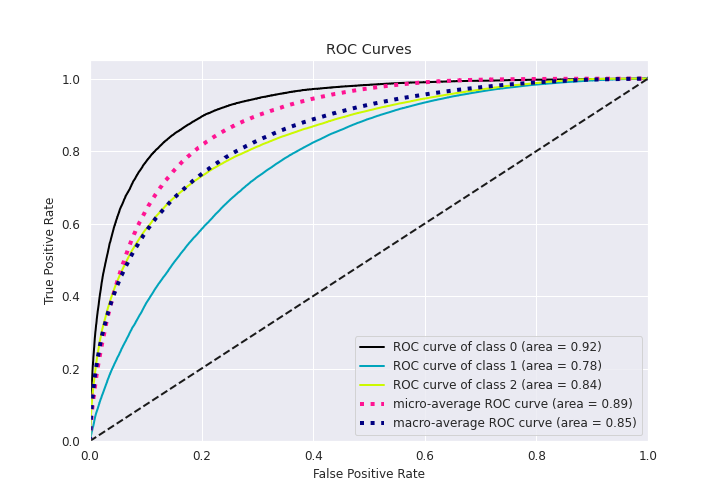
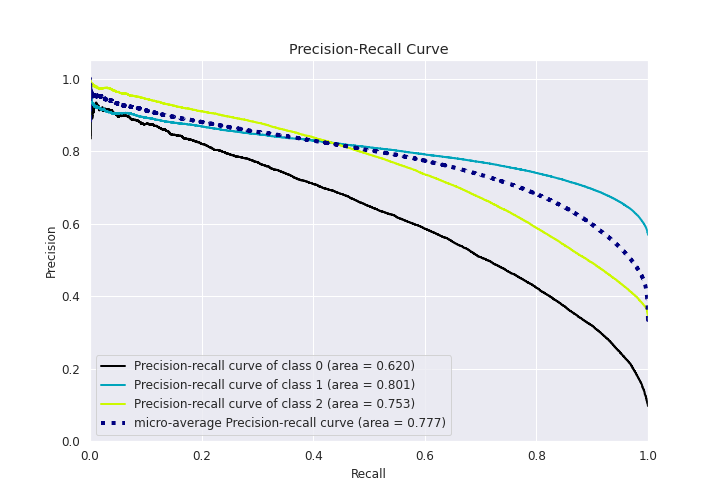

# Summary of 29_CatBoost

[<< Go back](../README.md)

## CatBoost
- **n_jobs**: 8
- **learning_rate**: 0.15
- **depth**: 5
- **rsm**: 1.0
- **loss_function**: MultiClass
- **eval_metric**: TotalF1:average=Micro
- **num_class**: 3
- **explain_level**: 1

## Validation
 - **validation_type**: kfold
 - **k_folds**: 5
 - **shuffle**: True
 - **stratify**: True

## Optimized metric
f1

## Training time

148.2 seconds

### Metric details
|           |            0 |             1 |            2 |   accuracy |     macro avg |   weighted avg |   logloss |
|:----------|-------------:|--------------:|-------------:|-----------:|--------------:|---------------:|----------:|
| precision |     0.687138 |      0.719088 |     0.744345 |   0.723783 |      0.716857 |       0.724464 |  0.622044 |
| recall    |     0.442802 |      0.851264 |     0.588003 |   0.723783 |      0.627356 |       0.723783 |  0.622044 |
| f1-score  |     0.538552 |      0.779613 |     0.657002 |   0.723783 |      0.658389 |       0.715343 |  0.622044 |
| support   | 20088        | 118606        | 69787        |   0.723783 | 208481        |  208481        |  0.622044 |

## Confusion matrix
|              |   Predicted as 0 |   Predicted as 1 |   Predicted as 2 |
|:-------------|-----------------:|-----------------:|-----------------:|
| Labeled as 0 |             8895 |            10955 |              238 |
| Labeled as 1 |             3785 |           100965 |            13856 |
| Labeled as 2 |              265 |            28487 |            41035 |

## Learning curves

## Permutation-based Importance

## Confusion Matrix

## Normalized Confusion Matrix

## ROC Curve

## Precision Recall Curve

[<< Go back](../README.md)
