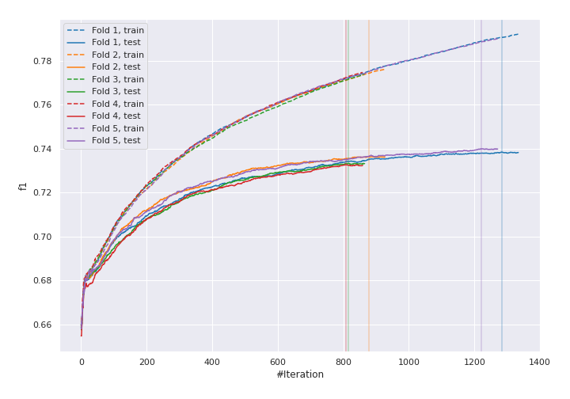
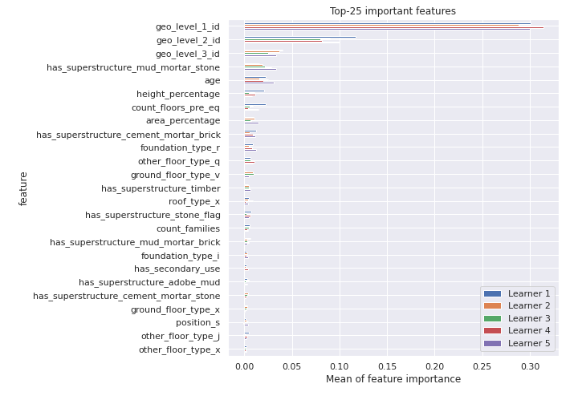
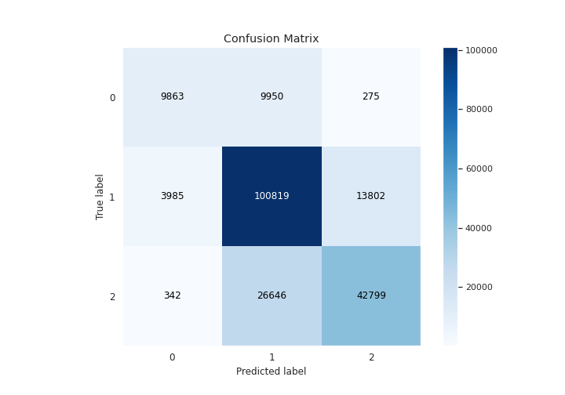
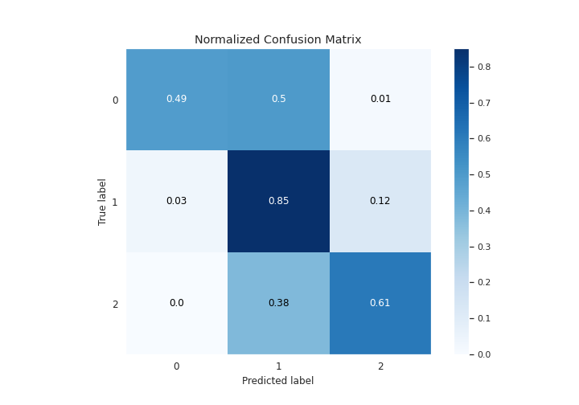
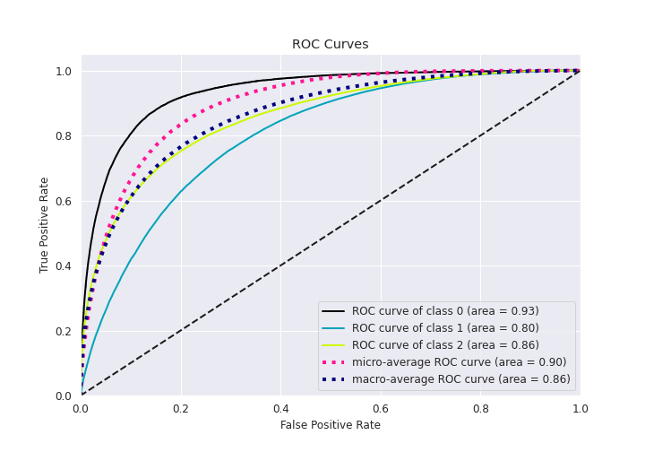
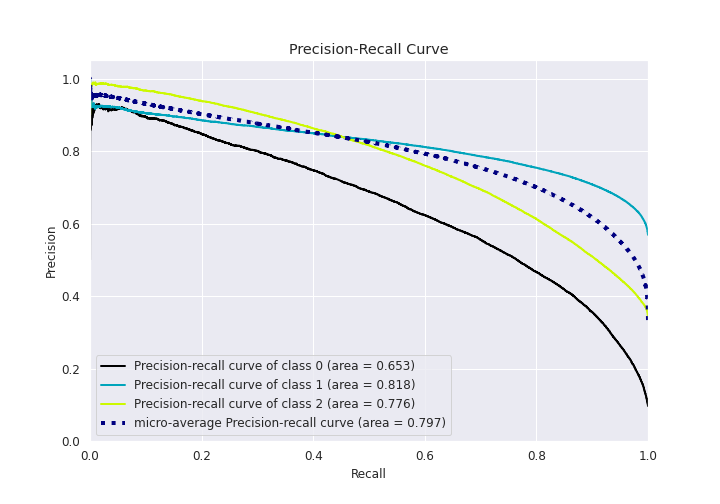

# Summary of 2_Default_Xgboost

[<< Go back](../README.md)

## Extreme Gradient Boosting (Xgboost)
- **n_jobs**: 8
- **objective**: multi:softprob
- **eta**: 0.075
- **max_depth**: 6
- **min_child_weight**: 1
- **subsample**: 1.0
- **colsample_bytree**: 1.0
- **eval_metric**: f1
- **num_class**: 3
- **explain_level**: 1

## Validation
 - **validation_type**: kfold
 - **k_folds**: 5
 - **shuffle**: True
 - **stratify**: True

## Optimized metric
f1

## Training time

656.2 seconds

### Metric details
|           |            0 |             1 |            2 |   accuracy |     macro avg |   weighted avg |   logloss |
|:----------|-------------:|--------------:|-------------:|-----------:|--------------:|---------------:|----------:|
| precision |     0.695067 |      0.733683 |     0.752497 |   0.736187 |      0.727082 |       0.73626  |  0.595219 |
| recall    |     0.49099  |      0.850033 |     0.61328  |   0.736187 |      0.651434 |       0.736187 |  0.595219 |
| f1-score  |     0.575471 |      0.787584 |     0.675793 |   0.736187 |      0.679616 |       0.729725 |  0.595219 |
| support   | 20088        | 118606        | 69787        |   0.736187 | 208481        |  208481        |  0.595219 |

## Confusion matrix
|              |   Predicted as 0 |   Predicted as 1 |   Predicted as 2 |
|:-------------|-----------------:|-----------------:|-----------------:|
| Labeled as 0 |             9863 |             9950 |              275 |
| Labeled as 1 |             3985 |           100819 |            13802 |
| Labeled as 2 |              342 |            26646 |            42799 |

## Learning curves

## Permutation-based Importance

## Confusion Matrix

## Normalized Confusion Matrix

## ROC Curve

## Precision Recall Curve

[<< Go back](../README.md)
