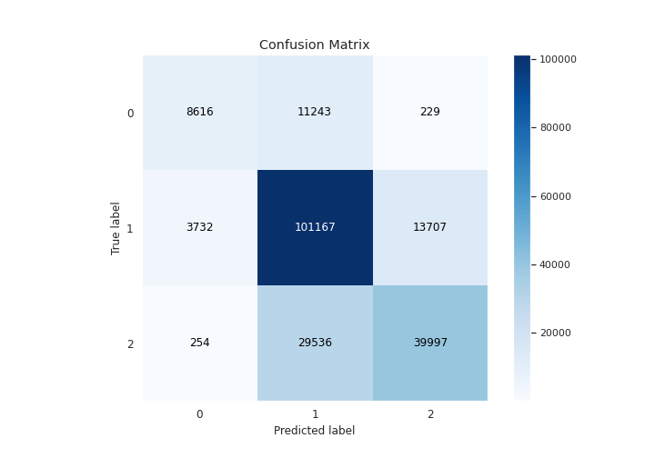

# Summary of 3_Default_CatBoost

[<< Go back](../README.md)

## CatBoost
- **n_jobs**: 8
- **learning_rate**: 0.15
- **depth**: 5
- **rsm**: 1
- **loss_function**: MultiClass
- **eval_metric**: TotalF1:average=Micro
- **num_class**: 3
- **explain_level**: 1

## Validation
 - **validation_type**: kfold
 - **k_folds**: 5
 - **shuffle**: True
 - **stratify**: True

## Optimized metric
f1

## Training time

108.8 seconds

### Metric details
|           |            0 |             1 |            2 |   accuracy |     macro avg |   weighted avg |   logloss |
|:----------|-------------:|--------------:|-------------:|-----------:|--------------:|---------------:|----------:|
| precision |     0.683701 |      0.712715 |     0.741605 |   0.718435 |      0.712674 |       0.71959  |  0.632133 |
| recall    |     0.428913 |      0.852967 |     0.57313  |   0.718435 |      0.618336 |       0.718435 |  0.632133 |
| f1-score  |     0.527134 |      0.776559 |     0.646573 |   0.718435 |      0.650089 |       0.709014 |  0.632133 |
| support   | 20088        | 118606        | 69787        |   0.718435 | 208481        |  208481        |  0.632133 |

## Confusion matrix
|              |   Predicted as 0 |   Predicted as 1 |   Predicted as 2 |
|:-------------|-----------------:|-----------------:|-----------------:|
| Labeled as 0 |             8616 |            11243 |              229 |
| Labeled as 1 |             3732 |           101167 |            13707 |
| Labeled as 2 |              254 |            29536 |            39997 |

## Learning curves

## Permutation-based Importance

## Confusion Matrix

## Normalized Confusion Matrix

## ROC Curve

## Precision Recall Curve

[<< Go back](../README.md)
