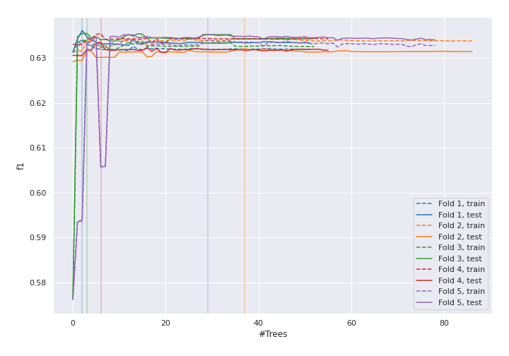

# Summary of 4_Default_RandomForest

[<< Go back](../README.md)

## Random Forest
- **n_jobs**: 8
- **criterion**: gini
- **max_features**: 0.9
- **min_samples_split**: 30
- **max_depth**: 4
- **eval_metric_name**: f1
- **num_class**: 3
- **explain_level**: 1

## Validation
 - **validation_type**: kfold
 - **k_folds**: 5
 - **shuffle**: True
 - **stratify**: True

## Optimized metric
f1

## Training time

76.8 seconds

### Metric details
|           |            0 |             1 |            2 |   accuracy |     macro avg |   weighted avg |   logloss |
|:----------|-------------:|--------------:|-------------:|-----------:|--------------:|---------------:|----------:|
| precision |     0.593901 |      0.63248  |     0.654467 |   0.634537 |      0.626949 |       0.636123 |  0.772966 |
| recall    |     0.275339 |      0.870917 |     0.336194 |   0.634537 |      0.49415  |       0.634537 |  0.772966 |
| f1-score  |     0.376246 |      0.732791 |     0.444205 |   0.634537 |      0.517747 |       0.601835 |  0.772966 |
| support   | 20088        | 118606        | 69787        |   0.634537 | 208481        |  208481        |  0.772966 |

## Confusion matrix
|              |   Predicted as 0 |   Predicted as 1 |   Predicted as 2 |
|:-------------|-----------------:|-----------------:|-----------------:|
| Labeled as 0 |             5531 |            13874 |              683 |
| Labeled as 1 |             3606 |           103296 |            11704 |
| Labeled as 2 |              176 |            46149 |            23462 |

## Learning curves

## Permutation-based Importance

## Confusion Matrix

## Normalized Confusion Matrix

## ROC Curve

## Precision Recall Curve

[<< Go back](../README.md)
