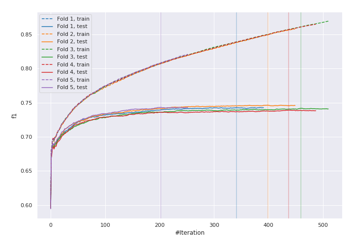
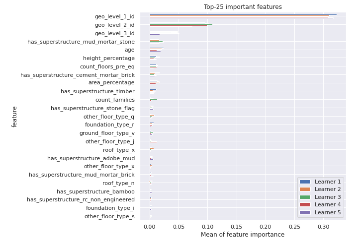
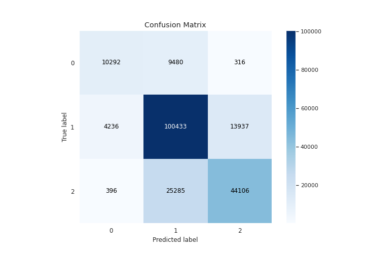
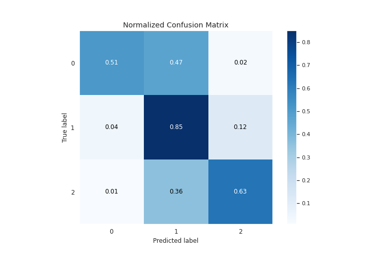
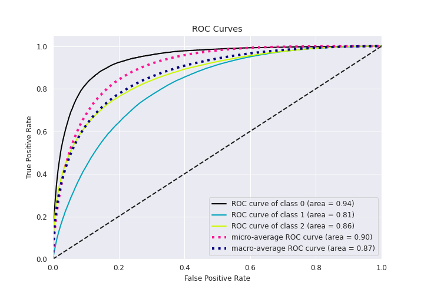
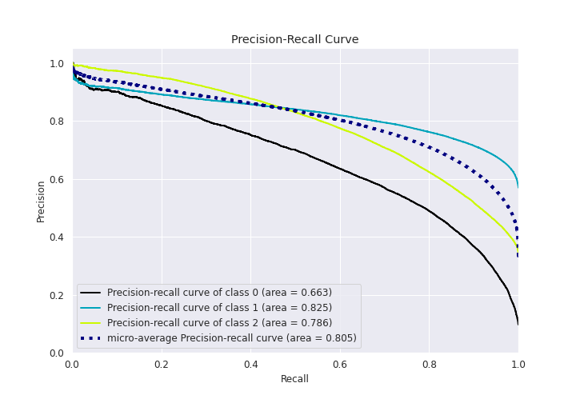

# Summary of 5_Xgboost

[<< Go back](../README.md)

## Extreme Gradient Boosting (Xgboost)
- **n_jobs**: 8
- **objective**: multi:softprob
- **eta**: 0.15
- **max_depth**: 9
- **min_child_weight**: 1
- **subsample**: 0.8
- **colsample_bytree**: 0.5
- **eval_metric**: f1
- **num_class**: 3
- **explain_level**: 1

## Validation
 - **validation_type**: kfold
 - **k_folds**: 5
 - **shuffle**: True
 - **stratify**: True

## Optimized metric
f1

## Training time

518.2 seconds

### Metric details
|           |            0 |             1 |            2 |   accuracy |     macro avg |   weighted avg |   logloss |
|:----------|-------------:|--------------:|-------------:|-----------:|--------------:|---------------:|----------:|
| precision |     0.689627 |      0.742859 |     0.75577  |   0.742662 |      0.729419 |       0.742052 |  0.583467 |
| recall    |     0.512346 |      0.846778 |     0.632009 |   0.742662 |      0.663711 |       0.742662 |  0.583467 |
| f1-score  |     0.587913 |      0.791422 |     0.688371 |   0.742662 |      0.689235 |       0.737318 |  0.583467 |
| support   | 20088        | 118606        | 69787        |   0.742662 | 208481        |  208481        |  0.583467 |

## Confusion matrix
|              |   Predicted as 0 |   Predicted as 1 |   Predicted as 2 |
|:-------------|-----------------:|-----------------:|-----------------:|
| Labeled as 0 |            10292 |             9480 |              316 |
| Labeled as 1 |             4236 |           100433 |            13937 |
| Labeled as 2 |              396 |            25285 |            44106 |

## Learning curves

## Permutation-based Importance

## Confusion Matrix

## Normalized Confusion Matrix

## ROC Curve

## Precision Recall Curve

[<< Go back](../README.md)
