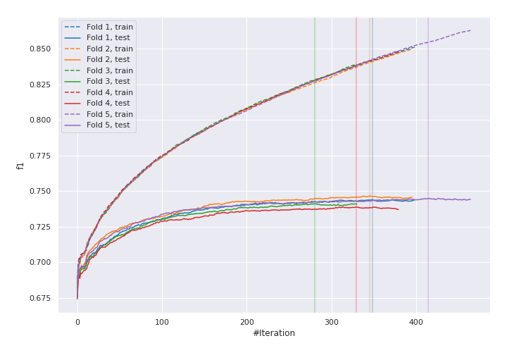
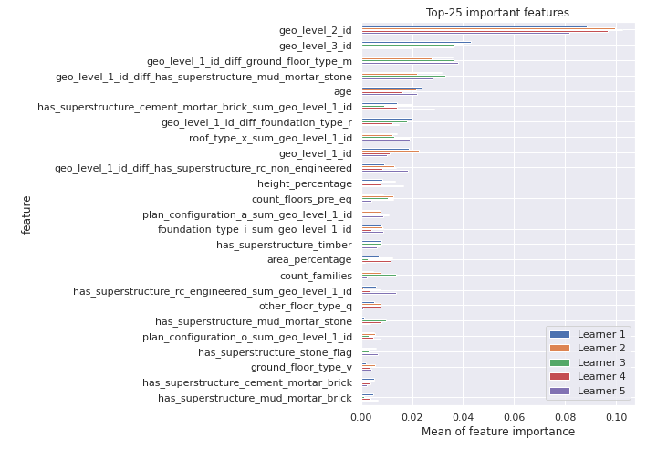
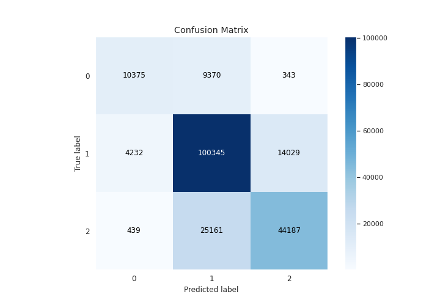
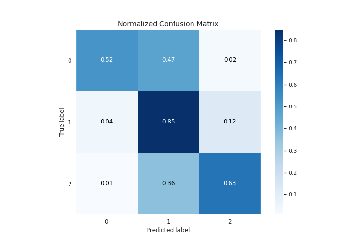
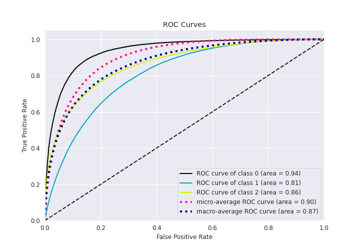
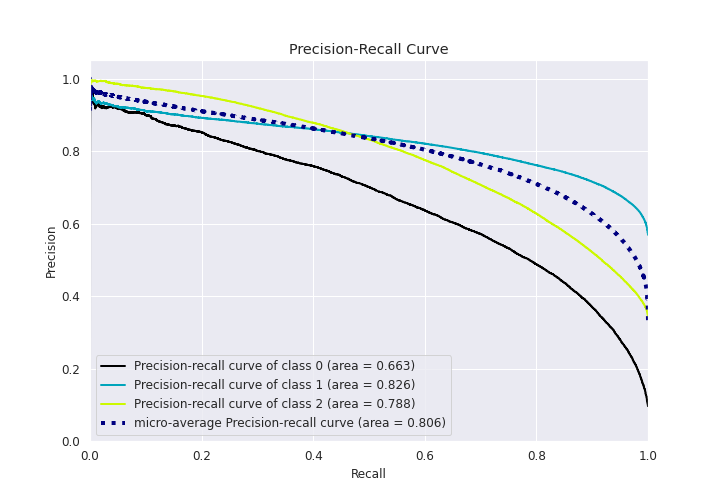

# Summary of 5_Xgboost_GoldenFeatures

[<< Go back](../README.md)

## Extreme Gradient Boosting (Xgboost)
- **n_jobs**: 8
- **objective**: multi:softprob
- **eta**: 0.15
- **max_depth**: 9
- **min_child_weight**: 1
- **subsample**: 0.8
- **colsample_bytree**: 0.5
- **eval_metric**: f1
- **num_class**: 3
- **explain_level**: 1

## Validation
 - **validation_type**: kfold
 - **k_folds**: 5
 - **shuffle**: True
 - **stratify**: True

## Optimized metric
f1

## Training time

538.0 seconds

### Metric details
|           |            0 |             1 |            2 |   accuracy |     macro avg |   weighted avg |   logloss |
|:----------|-------------:|--------------:|-------------:|-----------:|--------------:|---------------:|----------:|
| precision |     0.689552 |      0.74398  |     0.754572 |   0.743027 |      0.729368 |       0.742281 |  0.581704 |
| recall    |     0.516477 |      0.846036 |     0.63317  |   0.743027 |      0.665228 |       0.743027 |  0.581704 |
| f1-score  |     0.590596 |      0.791733 |     0.688561 |   0.743027 |      0.690296 |       0.737817 |  0.581704 |
| support   | 20088        | 118606        | 69787        |   0.743027 | 208481        |  208481        |  0.581704 |

## Confusion matrix
|              |   Predicted as 0 |   Predicted as 1 |   Predicted as 2 |
|:-------------|-----------------:|-----------------:|-----------------:|
| Labeled as 0 |            10375 |             9370 |              343 |
| Labeled as 1 |             4232 |           100345 |            14029 |
| Labeled as 2 |              439 |            25161 |            44187 |

## Learning curves

## Permutation-based Importance

## Confusion Matrix

## Normalized Confusion Matrix

## ROC Curve

## Precision Recall Curve

[<< Go back](../README.md)
