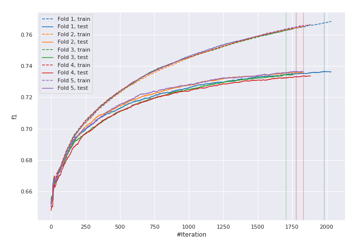
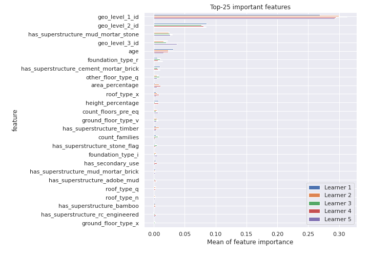
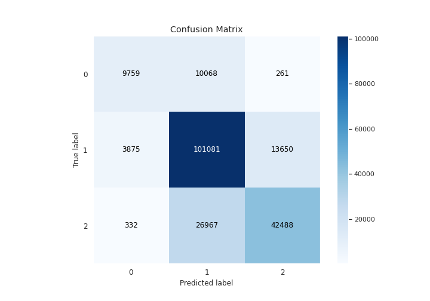
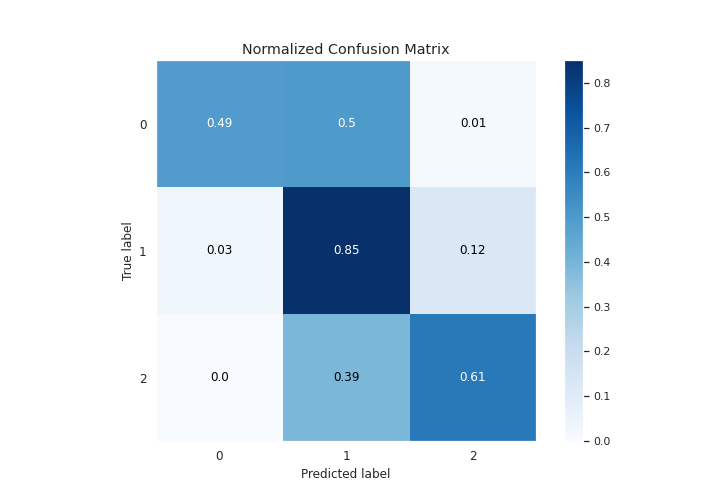
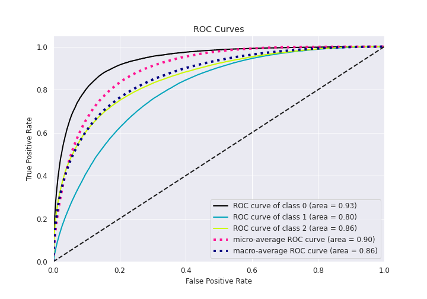
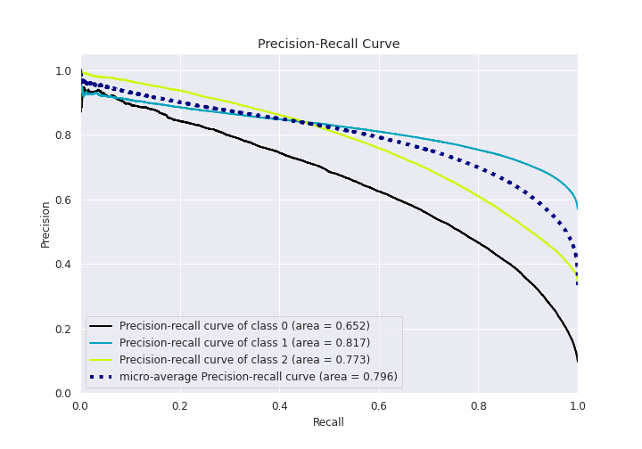

# Summary of 6_Xgboost

[<< Go back](../README.md)

## Extreme Gradient Boosting (Xgboost)
- **n_jobs**: 8
- **objective**: multi:softprob
- **eta**: 0.05
- **max_depth**: 5
- **min_child_weight**: 5
- **subsample**: 0.9
- **colsample_bytree**: 1.0
- **eval_metric**: f1
- **num_class**: 3
- **explain_level**: 1

## Validation
 - **validation_type**: kfold
 - **k_folds**: 5
 - **shuffle**: True
 - **stratify**: True

## Optimized metric
f1

## Training time

996.6 seconds

### Metric details
|           |            0 |             1 |            2 |   accuracy |     macro avg |   weighted avg |   logloss |
|:----------|-------------:|--------------:|-------------:|-----------:|--------------:|---------------:|----------:|
| precision |     0.698768 |      0.731856 |     0.753347 |   0.735453 |      0.72799  |       0.735862 |  0.597506 |
| recall    |     0.485812 |      0.852242 |     0.608824 |   0.735453 |      0.648959 |       0.735453 |  0.597506 |
| f1-score  |     0.573149 |      0.787474 |     0.673419 |   0.735453 |      0.678014 |       0.728644 |  0.597506 |
| support   | 20088        | 118606        | 69787        |   0.735453 | 208481        |  208481        |  0.597506 |

## Confusion matrix
|              |   Predicted as 0 |   Predicted as 1 |   Predicted as 2 |
|:-------------|-----------------:|-----------------:|-----------------:|
| Labeled as 0 |             9759 |            10068 |              261 |
| Labeled as 1 |             3875 |           101081 |            13650 |
| Labeled as 2 |              332 |            26967 |            42488 |

## Learning curves

## Permutation-based Importance

## Confusion Matrix

## Normalized Confusion Matrix

## ROC Curve

## Precision Recall Curve

[<< Go back](../README.md)
