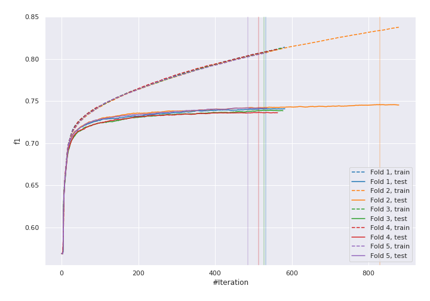
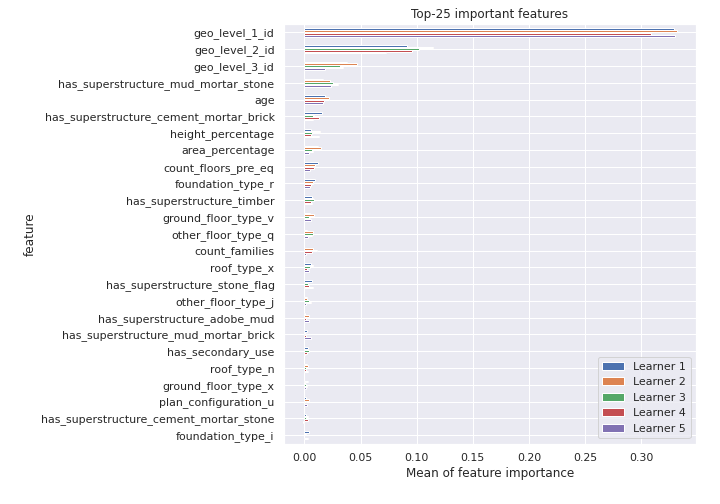
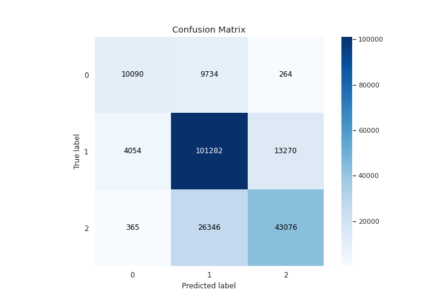
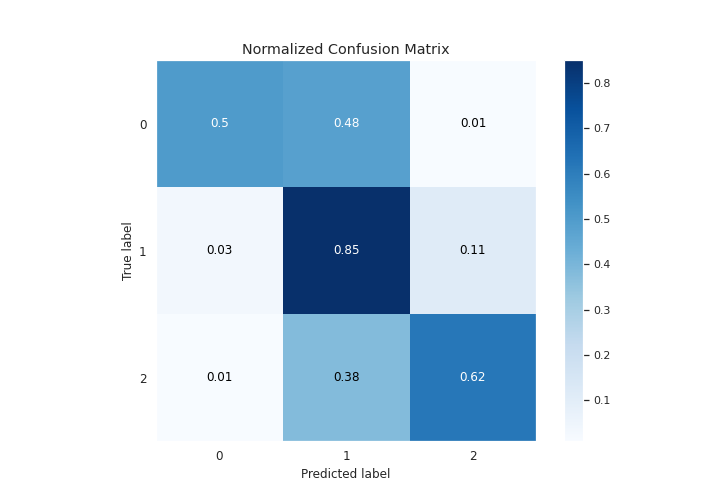
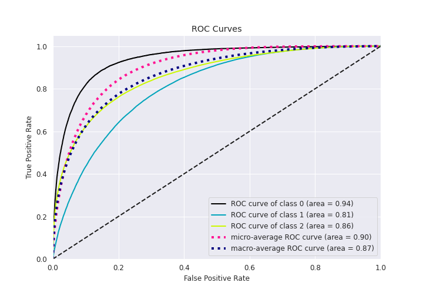
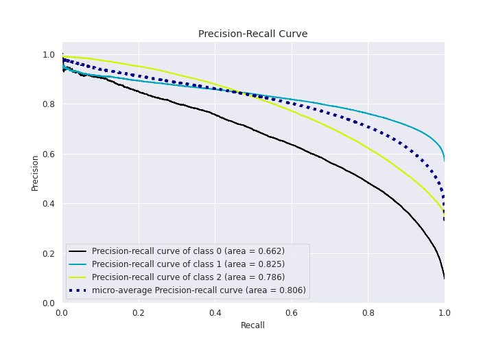

# Summary of 9_LightGBM

[<< Go back](../README.md)

## LightGBM
- **n_jobs**: 8
- **objective**: multiclass
- **num_leaves**: 127
- **learning_rate**: 0.05
- **feature_fraction**: 0.8
- **bagging_fraction**: 0.8
- **min_data_in_leaf**: 20
- **metric**: custom
- **custom_eval_metric_name**: f1
- **num_class**: 3
- **explain_level**: 1

## Validation
 - **validation_type**: kfold
 - **k_folds**: 5
 - **shuffle**: True
 - **stratify**: True

## Optimized metric
f1

## Training time

519.2 seconds

### Metric details
|           |            0 |             1 |            2 |   accuracy |     macro avg |   weighted avg |   logloss |
|:----------|-------------:|--------------:|-------------:|-----------:|--------------:|---------------:|----------:|
| precision |     0.69543  |      0.737336 |     0.760926 |   0.740825 |      0.731231 |       0.741195 |  0.583866 |
| recall    |     0.50229  |      0.853937 |     0.61725  |   0.740825 |      0.657825 |       0.740825 |  0.583866 |
| f1-score  |     0.583288 |      0.791365 |     0.681598 |   0.740825 |      0.685417 |       0.734572 |  0.583866 |
| support   | 20088        | 118606        | 69787        |   0.740825 | 208481        |  208481        |  0.583866 |

## Confusion matrix
|              |   Predicted as 0 |   Predicted as 1 |   Predicted as 2 |
|:-------------|-----------------:|-----------------:|-----------------:|
| Labeled as 0 |            10090 |             9734 |              264 |
| Labeled as 1 |             4054 |           101282 |            13270 |
| Labeled as 2 |              365 |            26346 |            43076 |

## Learning curves

## Permutation-based Importance

## Confusion Matrix

## Normalized Confusion Matrix

## ROC Curve

## Precision Recall Curve

[<< Go back](../README.md)
