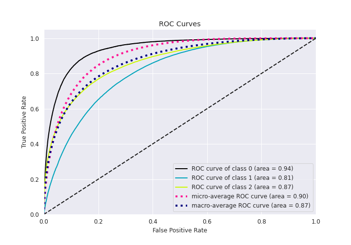

# Summary of Ensemble

[<< Go back](../README.md)

## Ensemble structure
| Model                     |   Weight |
|:--------------------------|---------:|
| 19_Xgboost_GoldenFeatures |        2 |
| 20_Xgboost_GoldenFeatures |        4 |
| 21_Xgboost                |        1 |
| 5_Xgboost                 |        3 |
| 5_Xgboost_GoldenFeatures  |        3 |
| 9_LightGBM                |        1 |

### Metric details
|           |            0 |             1 |            2 |   accuracy |     macro avg |   weighted avg |   logloss |
|:----------|-------------:|--------------:|-------------:|-----------:|--------------:|---------------:|----------:|
| precision |     0.697017 |      0.74324  |     0.758372 |   0.744178 |      0.732876 |       0.743852 |  0.576282 |
| recall    |     0.512943 |      0.849839 |     0.631163 |   0.744178 |      0.664648 |       0.744178 |  0.576282 |
| f1-score  |     0.590978 |      0.792973 |     0.688945 |   0.744178 |      0.690965 |       0.738688 |  0.576282 |
| support   | 20088        | 118606        | 69787        |   0.744178 | 208481        |  208481        |  0.576282 |

## Confusion matrix
|              |   Predicted as 0 |   Predicted as 1 |   Predicted as 2 |
|:-------------|-----------------:|-----------------:|-----------------:|
| Labeled as 0 |            10304 |             9470 |              314 |
| Labeled as 1 |             4090 |           100796 |            13720 |
| Labeled as 2 |              389 |            25351 |            44047 |

## Learning curves

## Confusion Matrix

## Normalized Confusion Matrix

## ROC Curve

## Precision Recall Curve

[<< Go back](../README.md)
