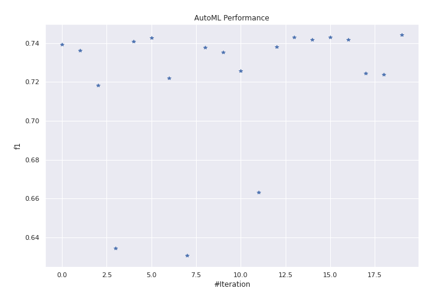
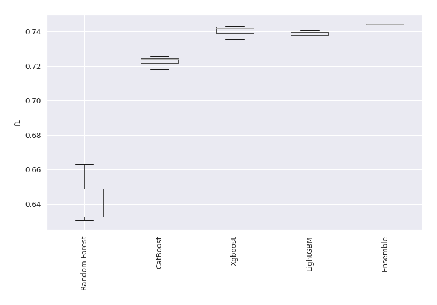
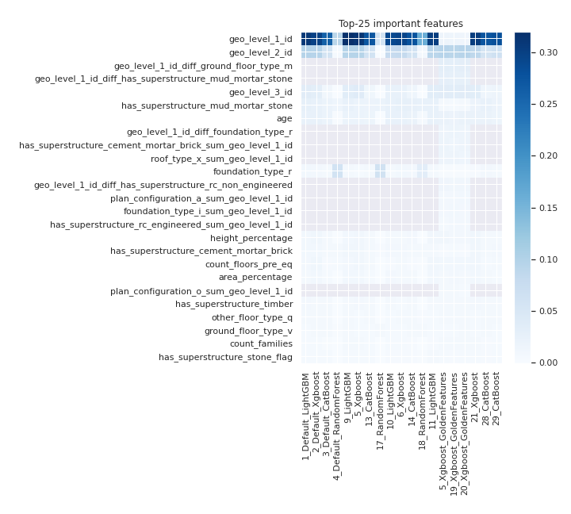
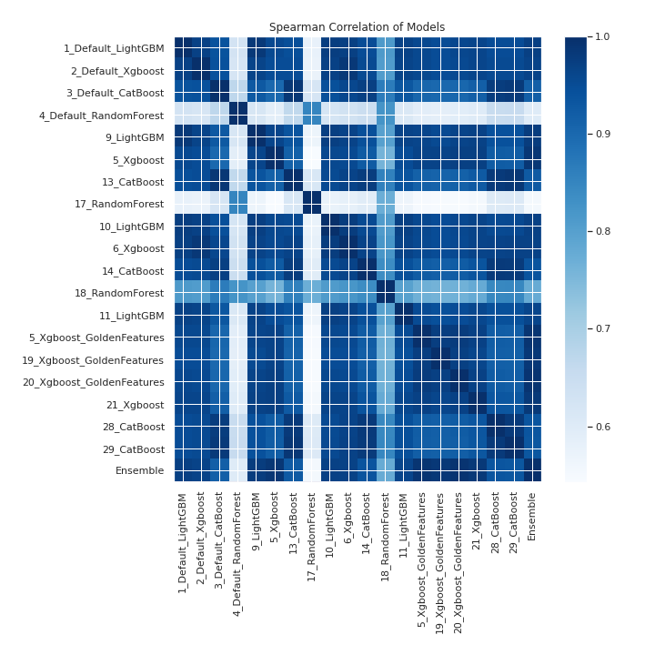

# AutoML Leaderboard

| Best model   | name                                                             | model_type    | metric_type   |   metric_value |   train_time |   single_prediction_time |
|:-------------|:-----------------------------------------------------------------|:--------------|:--------------|---------------:|-------------:|-------------------------:|
|              | [1_Default_LightGBM](1_Default_LightGBM/README.md)               | LightGBM      | f1            |       0.73919  |       632.82 |                   0.0442 |
|              | [2_Default_Xgboost](2_Default_Xgboost/README.md)                 | Xgboost       | f1            |       0.736187 |       657.93 |                   0.0537 |
|              | [3_Default_CatBoost](3_Default_CatBoost/README.md)               | CatBoost      | f1            |       0.718435 |       110.73 |                   0.0517 |
|              | [4_Default_RandomForest](4_Default_RandomForest/README.md)       | Random Forest | f1            |       0.634537 |        78.36 |                   0.0748 |
|              | [9_LightGBM](9_LightGBM/README.md)                               | LightGBM      | f1            |       0.740825 |       521.11 |                   0.0445 |
|              | [5_Xgboost](5_Xgboost/README.md)                                 | Xgboost       | f1            |       0.742662 |       519.92 |                   0.0532 |
|              | [13_CatBoost](13_CatBoost/README.md)                             | CatBoost      | f1            |       0.721941 |       175.51 |                   0.0509 |
|              | [17_RandomForest](17_RandomForest/README.md)                     | Random Forest | f1            |       0.630691 |        76.89 |                   0.0744 |
|              | [10_LightGBM](10_LightGBM/README.md)                             | LightGBM      | f1            |       0.73766  |       512.29 |                   0.0454 |
|              | [6_Xgboost](6_Xgboost/README.md)                                 | Xgboost       | f1            |       0.735453 |       998.32 |                   0.0547 |
|              | [14_CatBoost](14_CatBoost/README.md)                             | CatBoost      | f1            |       0.725663 |       118.98 |                   0.0521 |
|              | [18_RandomForest](18_RandomForest/README.md)                     | Random Forest | f1            |       0.663159 |       119.6  |                   0.0833 |
|              | [11_LightGBM](11_LightGBM/README.md)                             | LightGBM      | f1            |       0.738019 |       309.03 |                   0.0434 |
|              | [5_Xgboost_GoldenFeatures](5_Xgboost_GoldenFeatures/README.md)   | Xgboost       | f1            |       0.743027 |       539.68 |                   0.0734 |
|              | [19_Xgboost_GoldenFeatures](19_Xgboost_GoldenFeatures/README.md) | Xgboost       | f1            |       0.741909 |       549.65 |                   0.0722 |
|              | [20_Xgboost_GoldenFeatures](20_Xgboost_GoldenFeatures/README.md) | Xgboost       | f1            |       0.743032 |       532.98 |                   0.0731 |
|              | [21_Xgboost](21_Xgboost/README.md)                               | Xgboost       | f1            |       0.741674 |       419.51 |                   0.0523 |
|              | [28_CatBoost](28_CatBoost/README.md)                             | CatBoost      | f1            |       0.724478 |       135.25 |                   0.0511 |
|              | [29_CatBoost](29_CatBoost/README.md)                             | CatBoost      | f1            |       0.723783 |       150.14 |                   0.0515 |
| **the best** | [Ensemble](Ensemble/README.md)                                   | Ensemble      | f1            |       0.744178 |        24.77 |                   0.3661 |

### AutoML Performance

### AutoML Performance Boxplot

### Features Importance

### Spearman Correlation of Models

